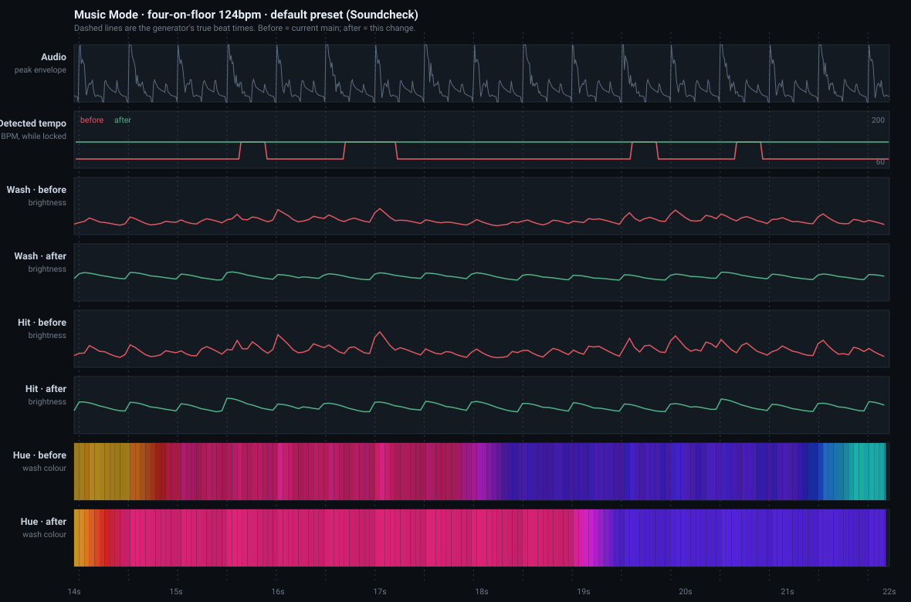

# Music Mode: why it read as flashing, and what changed

This is the measurement record behind the choreography and beat-tracking
changes. [MUSIC_MODE_ARCHITECTURE.md](MUSIC_MODE_ARCHITECTURE.md) describes the
pipeline; this file says what it was measured doing, and what it does now.

## How these numbers were produced

There is no Swift toolchain on Linux, so the Swift pipeline —
`MusicFeatureAnalyzer`, `BeatTracker`/`MetreTracker`, `MusicChoreographyEngine`,
`MusicLightingRenderer` and the session controller's 20 Hz render clock — was
transliterated into Node and driven with synthesised audio.

Two levels of fidelity, and the difference matters when reading the results:

- **The choreography, renderer and beat tracker ports are exact.** They are pure
  arithmetic, transliterated statement by statement, and every constant is
  diffed against the Swift mechanically.
- **The analyzer port is structurally faithful but numerically approximate.**
  Band layout, flux, auto-gain, envelopes and snapshot assembly are exact;
  `vDSP_fft_zrip` is replaced by a plain radix-2 FFT scaled to match its output,
  and the Hann window is the periodic form.

The harness is deliberately **not** committed. This repository already carries
one parallel implementation of the music pipeline in `web/`, with explicit
lockstep rules, because parallel implementations drift and the drift causes real
bugs. A third copy that neither the app nor CI exercises would rot immediately
and then mislead whoever read it next. The durable form of these measurements is
the regression tests in `LumenDeskTests/MusicModeTests.swift`; the method is
described here precisely enough to rebuild.

The port is validated against an assertion that already passes in Swift:
`MusicModeTests.testAnalyzerReportsTheMusicalPulseNotTheOnsetRate` feeds a
120 BPM kick with sixteenth hats and asserts tempo 120 ± 6, interval 0.5 ± 0.03,
lock before 8 s, and a beat count within 2.5 of the true count. The port
reproduces it: **tempo 119.82, interval 0.5008, lock at 3.84 s, 21 beats against
20.3 expected.**

Everything below is measured on synthetic material. None of it is evidence about
physical light timing; see [What still needs a human and a
room](#what-still-needs-a-human-and-a-room).

## Before and after, on one screen

Eight seconds of the dense 124 BPM groove on the default preset. Dashed lines are
the generator's true beat times. Top to bottom: the audio envelope; the detected
tempo (red flipping between 124 and 82.7, green flat at 124); wash brightness
before and after; hit brightness before and after; and the wash hue as a colour
strip, before and after. This is a simulation of the choreography, not evidence
about physical light timing.

## What was actually wrong

Four findings, in order of how much they contributed.

### 1. The tempo estimate flipped between the beat and its dotted relative, at full confidence

On a realistic 124 BPM groove — swept kick, noise snare, sixteenth hats, moving
bassline — the tracker did not settle on 124. It alternated between 124.3 and
**82.7 BPM, which is exactly the dotted quarter** (1.5× the beat period), and it
reported `beatConfidence = 1.000` the whole time.

| Dense 124 BPM groove, 26 s | before | after |
| --- | --- | --- |
| Locked frames within 4 % of the true pulse | **59 %** | **100 %** |
| Tempo switches while locked (>10 % jump) | **44** | **0** |
| Range of reported tempo | 82.6 – 124.5 | 124.2 – 124.3 |

Each switch ran `resyncPhase`, which re-anchors the grid. The choreography
extrapolates its brightness contour from that anchor, so the contour restarted
at an arbitrary point dozens of times a run. That is flashing with no relation to
the music, and no amount of smoothing downstream could have hidden it.

Three things caused it, and all three are fixed:

- The broadband onset function is dominated by hi-hats, and hats correlate just
  as well at 1.5× the beat as the kick does at 1×. The kick band was mixed into
  one signal *before* the transform, at 40 % weight, where it could not win the
  argument. It is now autocorrelated separately and votes on the score.
- A beat period rarely lands on a whole number of analysis hops, so its
  correlation peak splits across two lags while a rival that does land on one
  keeps its peak intact. The autocorrelation is now 3-tap smoothed before the
  comb sum, which removes that bin-alignment bias.
- Confidence measured the winner's prominence against the *mean of every lag*,
  which stays near 1 when two candidates are neck and neck. It now measures the
  gap to the nearest genuinely different period, so a coin-flip reports as one.

A disagreeing period must also now win several estimates in a row before the grid
moves, and a simple musical relative (half, double, dotted) has to argue twice as
long, because those are the likeliest ways to be wrong.

### 2. A sustained chord locked a tempo and pulsed the room

Three held tones, no rhythmic content at all:

| 20 s pad | before | after |
| --- | --- | --- |
| Frames reporting a locked tempo | **88 %** | **0 %** |
| Peak beat confidence | **1.000** | 0.143 |

The onset function still ripples on a held note, and the auto-gain amplifies that
ripple. Variance alone cannot tell it apart from music. Locking now also requires
the onset function to be *peaky* — drums give a tall crest against a low floor, a
held chord does not.

### 3. Every beat hit the same brightness, and the fall was a snap

`musicalRelease` was `min(0.3, max(0.06, interval × 0.12))`. At 120 BPM that is
`0.5 × 0.12 = 0.06`, the floor — so **for every tempo at or above 120 BPM the
release time constant was pinned at 60 ms.** At the 20 Hz render clock that is a
coefficient of 0.56 per frame: the light tracked the beat contour almost
instantly, plunging and recovering twice a second at full depth.

Meanwhile `drive` was clamped with `min(1, …)` and saturated on most beats, so
peak brightness was the same whether the music was loud or quiet.

Brightness is now a **bed plus a swell**. The bed is where a fixture rests; it
follows loudness over about half a second and carries dynamics. The swell is an
accent occupying part of the headroom above the bed, and it carries rhythm.
Because a fixture falls back to the bed rather than to the floor, a beat reads as
an accent on a lit room instead of the room going dark and coming back.

Measured on a locked 124 BPM grid at the real 20 Hz render clock, counting
monotonic runs that cover at least 0.25 of the brightness range — each one a
visible jump up or drop down:

| Large swings per second | before | after |
| --- | --- | --- |
| Hit fixture, Soundcheck (default) | **4.07** | **1.47** |
| Hit fixture, Club | **4.13** | **1.95** |
| Hit fixture, Concert | **4.13** | **2.65** |
| Wash fixture, Club | **2.60** | **0.29** |
| Wash fixture, Concert | **4.07** | **0.53** |

At 124 BPM there are 2.07 beats per second. Four swings a second is two per beat,
up and down — the rate the eye reads as strobing. The bar accent was also
deepened so only the strong beats swing hard, which is why the count drops below
one per beat without the beat becoming invisible.

Peak-to-trough ratio within a beat, and across a whole run, on the default preset
through the full pipeline:

| Scenario | wash ratio before → after | hit ratio before → after |
| --- | --- | --- |
| four-on-floor 124 | 2.10 → **1.34** | 2.55 → **1.50** |
| syncopated 100 | 2.09 → **1.38** | 2.69 → **1.64** |
| tempo change 100→132 | 2.69 → **1.61** | 3.29 → **1.88** |
| breakdown 128 | 2.39 → **1.81** | 2.97 → **1.95** |
| half-time 140 | 2.37 → **1.35** | 2.88 → **1.63** |
| sustained pad | 2.56 → **1.14** | 2.50 → **1.08** |

Perceived lightness is roughly L^0.43, so the same raw depth low in the range
looks far bigger than high in it. Measured in that space, total brightness
distance travelled per second on the wash fell from 0.66 to 0.27 on the dense
groove — a 59 % reduction — while the beat stayed visible at a median per-beat
ratio of 1.28.

### 4. Colour chased noise and snapped at arbitrary points

Three separate causes, all fixed:

- `chromaToHue` took the argmax of a 12-bin chroma vector every analysis frame.
  Two near-equal bins flip constantly on real music. With realistic chroma noise
  the hue travelled **0.3145 turns per second**; it now travels **0.0274** — an
  11.5× reduction — because a new bin must lead by 15 % and hold that lead for
  four frames before the hue follows it, and then it glides.
- `mood` is a per-frame band ratio and was fed in raw. It is now smoothed over
  2.5 s.
- Palette progression was a free-running accumulator quantized to *its own*
  integer boundaries. Entries-per-bar was not an integer, so a colour change
  landed at a different point in every bar rather than on a bar line, about 0.7
  times a second at the default setting. Colour is now held for a whole number of
  bars and crossed over during one beat at the bar line. Frames on which the hue
  changed at all fell from 63 of 340 to 33 of 340.

An accent fixture also used to flip hue by 180° whenever `snare × sensitivity`
crossed 0.42, with no hysteresis — a colour toggling on and off with the
backbeat. The accent role now simply sits on the complementary colour for the
whole show and expresses the snare through depth instead.

### Smaller findings, same direction

- `phraseLift` read `energySlope`, which is the difference between two analysis
  hops 10.7 ms apart — measurement noise, worth up to 0.22 of a fixture's drive.
  It now reads the gap between a 0.7 s and a 5 s energy envelope, which is a
  phrase building.
- Off the grid, drive was `max(beat, pulse)` — an onset envelope retriggered by
  every hi-hat. It is now a smoothed envelope with a bounded 0.28 s fall, so
  dense transients raise a level instead of firing a burst.
- Movement was a full-depth brightness oscillator applied to rooms of two or
  three bulbs, which cannot show travel. Its brightness depth now scales with how
  many targets the room actually has; segmented fixtures keep the full treatment.
- The latency compensation paid for transport but not for the envelope's own rise
  time, so peaks landed late. Frame-time bias moved from **+17 to +40 ms (late)**
  to **−21 to −33 ms (early)**. With the assumed 45 ms transport-plus-firmware
  delay, that is roughly 60–85 ms late before and 12–24 ms late after — but the
  45 ms figure is an assumption in the code, not a measurement, and this is the
  one number that genuinely needs a camera and a real bulb.

### What was not wrong

- **Flashes are not the cause and never were.** `photosensitivitySafeMode`
  defaults to `true` and no preset overrides it, so `FlashSafetyLimiter` blocks
  every flash out of the box. `flashApplied` was false on every frame of every
  scenario. The flashing the complaint describes is the brightness envelope
  itself, not the flash feature. The 3 Hz hard ceiling is untouched.
- **The analyzer's front end is sound.** Gapless STFT, log-magnitude flux over
  log-spaced bands, volume-independent onset strength: none of that needed
  changing, and none of it did.
- **Command throughput is not a bottleneck.** The renderer's per-transport
  ceilings hold at ~10 commands per second per fixture in every scenario, before
  and after, with coalescing absorbing the rest. There is no backlog.

## Native and web did differ materially

The web client had drifted from Swift in four ways beyond the shared defects, all
now closed:

| | before | after |
| --- | --- | --- |
| `musicalClock` | omitted the `beatCount` term, so half-time restarted its pulse every cycle | matches Swift |
| `paletteColor` | clamped ramp — reached the last entry and snapped back | cyclic, matches Swift |
| `sustainedLift` | absent | present |
| Bar rate | derived from the felt interval | derived from the grid interval, matches Swift |

Constants across `MusicChoreographyEngine.swift`, `choreography.ts` and the
measurement port are now diffed mechanically and agree.

## Regression tests

In `LumenDeskTests/MusicModeTests.swift`. Each pins behaviour the old engine got
wrong, and the three marked † fail against the old engine:

| Test | Asserts | Old engine |
| --- | --- | --- |
| `testBeatIsVisibleWithoutBecomingAStrobe` | median per-beat ratio in 1.15 – 2.0 | 1.51 (passes; upper bound is the guard) |
| `testLargeBrightnessSwingsStayBelowTheFlickerRate` † | hit < 2.5 swings/s, wash < 1.0 | 4.12 / 2.59 |
| `testLowBeatConfidenceDoesNotInventAPulse` † | per-beat ratio < 1.08 at confidence 0.2 | 1.135 |
| `testHueHoldsThroughChromaAndMoodNoise` † | < 0.1 hue turns/s, no frame over 30° | 0.318 turns/s |
| `testQuietMaterialIsNoMoreModulatedThanLoud` | quiet ≤ loud + 0.02 | passes |
| `testPaletteHoldsAcrossBarsInsteadOfChasingTransients` | colour changes on < 20 % of frames, and does change | 18.5 % (passes by a hair) |
| `testTempoHoldsThePulseThroughDenseRealisticMaterial` | > 90 % of locked frames within 4 % of the pulse, < 4 switches | 59 %, 44 switches |
| `testSustainedChordNeverLocksATempo` | never locks, confidence stays under 0.38 | locked 88 % of frames at confidence 1.0 |

The two tracker tests go through `MusicFeatureAnalyzer` with synthesised audio
rather than driving `BeatTracker` with a hand-written onset function. That is
deliberate: **fed an idealised onset function the old search handled dense
subdivisions perfectly.** The failure only appears in the flux of real material,
which is why the existing bare-ODF tests in `BeatTrackerTests` never caught it.

## What still needs a human and a room

Nothing here is evidence that the lights look good, only that the signals the
lights follow are better behaved. These remain open:

1. **Audible-to-visible timing on real hardware.** Film a bulb and a speaker
   together and measure the offset. The 45 ms `outputLatencyCompensation` is an
   assumption; LIFX LAN and Govee LAN almost certainly differ, and Govee's
   razer stream differs again. If the measured delay is not ~45 ms, that constant
   should be split per transport.
2. **Listening on real music.** Synthetic grooves cannot tell you whether a
   change lands musically. Worth an hour each on four-on-the-floor house, a
   half-time hip-hop track, something with a rubato intro, and a live recording
   that drifts in tempo.
3. **Does the wash now read as too subtle?** Median per-beat ratio 1.28 is a
   deliberate, measured choice. It may be a touch conservative in a bright room,
   and `beatSensitivity` is the knob — but if it consistently wants turning up,
   the default should move, not the user.
4. **Govee RGBIC segment behaviour** under the revised frame rate, on firmware.
5. **Multi-room load**, where several scopes share one analyzer.
6. **The `pad` case on real ambient music.** Refusing to lock is right for a held
   chord; it should be confirmed that genuinely ambient *music* with a slow pulse
   still gets a show rather than going inert.
