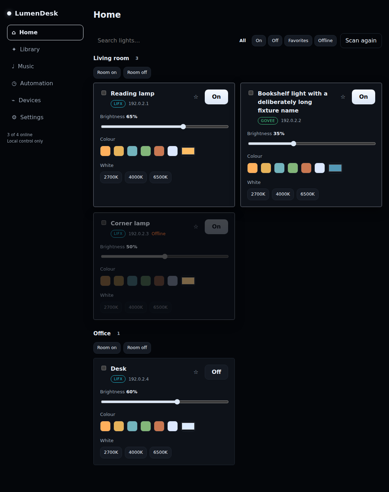
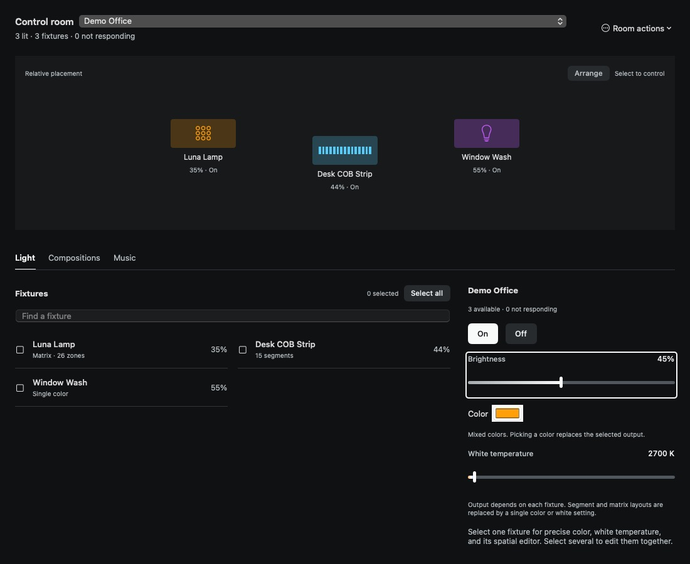
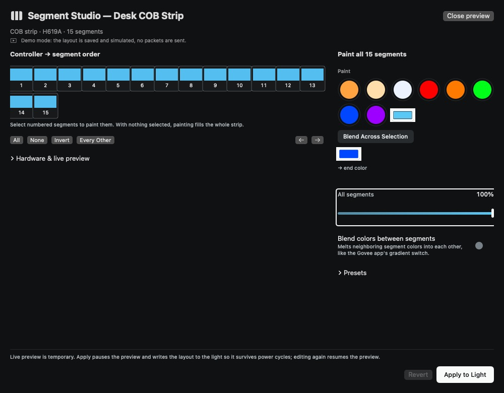
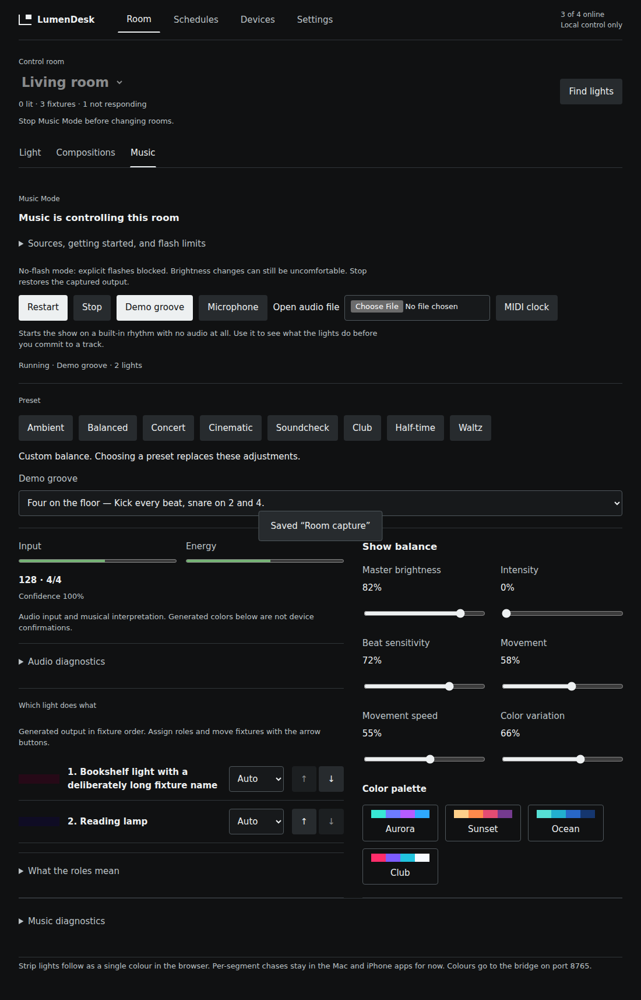

# A. Executive Summary

Implemented a room-centered redesign of the native macOS/iOS application and the
production browser client on `design/room-light-workspace`. The central change is
one continuous working context: choose a room, see its fixtures, select targets,
and change Light, Compositions or Music without establishing a second scope.

The former whole-home Plan and icon rail no longer organize everyday control.
Fixture marks show output and selection; one editor handles a room or selection.
Saved scenes have composition scores and explicit saved scope. Running effects
name their owner and expose restoration. Music separates input, interpretation,
generated output and configuration. Segment Studio and Luna use spatial canvases
with shared tools, selection marks and explicit preview/apply behavior.

The canonical manager, rooms, fixtures, scenes, Music configuration/topology,
transports and persistence schema remain. Main's Music repair PR #105 was merged
into this branch, not independently rewritten. Native production behavior at
`c843bd3` passed **241 tests**, macOS analysis and a generic iOS build. The bridge
passed **60 tests**; browser Music passed **21 tests**. Chromium interaction and
room axe checks passed in CI. Later browser layout/copy refinements were built,
run and visually checked locally. The final full browser script passed with **zero axe violations in Room, Music and setup**.

**Delivery status:** PR [#106](https://github.com/SeanPVera/LumenDesk/pull/106) was
closed externally during implementation. It has not been reopened or merged.
Changes and this report remain on the branch. Subsequent pushes do not trigger
its pull-request workflows. No physical-device validation, VoiceOver session or
iOS simulator visual review occurred. This is implemented work with the release
validation gaps in sections K–N, not a claim that every requested check is complete.

# B. Existing Design Diagnosis

Baseline: `3ceeec29`. Discovery read the actual production shell and manager,
platform branches, persistence, protocols, effects, Music documentation and tests;
`CLAUDE.md` existed and no applicable `AGENTS.md` was present. Some documentation
described older Home/Library or Spectral Bench versions; running source was the
reference. Initial native execution was unavailable, so native baseline findings
below are source evidence, not claimed before screenshots. After the local runtime recovered, the baseline browser Home was also rendered at 1100×900 with the same four-fixture data; it confirmed the repeated full-control cards and heavy sidebar.

| Area | Observed problem and evidence | User impact | Implemented response |
| --- | --- | --- | --- |
| Information architecture | `PlanWorkspaceView` presented all rooms; `LibraryWorkspaceView` owned another scope | A physical room was not a stable context across everyday tasks | Shared scope binding across Light, Compositions and Music |
| Navigation | `ProductShellView` used a narrow icon rail and Plan/Looks/Cues/Rig terminology | Destination meaning required recall; fixture editing was a detour | Named Room/Schedules/Devices/Settings navigation; native iOS tabs |
| Hierarchy | Full controls lived in a room/detail sheet while layout organization occupied the workspace | Color and precision competed with administration | Shared output editor; one selected fixture gets its inspector in place |
| Density | Repeated fixture controls and large library tiles; horizontal Music control groups | Repetition and narrow-window compression | Flat fixture directory, composition rows, adaptive groups and disclosures |
| Typography | Small instrument labels, technical-looking readouts; token floor was 10.5 pt | Weak distinction between names, metadata and measurements | 12 pt token floor, system text and tabular numbers; legacy direct-size exceptions documented |
| Color | Wash/glow treatments extended fixture color into large surfaces | Lighting content competed with the interface | Neutral surfaces; color confined to meaningful output marks and palettes |
| Controls | Disabled custom fader accessibility actions were not guarded | An unavailable control could still mutate its binding | Guard disabled nudges/commits; visible keyboard focus and 44 pt fader interaction region |
| Spatial representation | Plan supplied Ground floor / 1:50 framing despite relative placement data | Implied measured architecture the model did not contain | Labeled relative anchors or fixture order; room arrangement is advanced |
| Scenes/effects | Library cards looked alike despite saved snapshots versus running ownership | Unclear target set and replacement/restoration behavior | Snapshot scores, saved-scope copy and explicit effect owner/stop choices |
| Consistency | Brand/design/handoff prose and actual shell disagreed | Extensions risked reintroducing old patterns | Updated brand, design system, README and CLAUDE navigation guidance |
| Accessibility | Tiny swatches, glyph-only reordering, fixed groups, unconditional transitions | Difficult targeting, ambiguous state and narrow-layout friction | Numbered/checkmarked segments, named ordering actions, adaptive layouts and reduced-motion handling |
| Product identity | Layout mixed a faux plan with instrument/control-panel metaphors | Organization reflected implementation destinations more than control of a room | Named emitters, shared output and composition scores grounded in actual light state |

# C. Design Thesis

**Light in place:** LumenDesk looks like a field of named emitters because its
content is physical light. Darkness creates a neutral working ground. Fixture
color and relative intensity inhabit the output mark; names and status remain on
opaque ground. The interface does not glow everywhere.

Saved anchors describe relative placement. Unknown or crowded placement becomes
an explicitly ordered field. Segments and Luna zones retain internal boundaries;
Music ordering expresses choreography rather than pretending to be a floor plan.

Color is content: emitted color, white-temperature ramps, palette relationships,
and stored scene scores. Numeric values, native color selection and precise
fixture controls maintain precision. Selection, offline, roles and errors have
words or shapes as well as color. Motion acknowledges changes and generated
output, with reduced-motion accommodations; it is not background spectacle.

Rejected: icon-only primary navigation, a default sidebar, a calibrated-looking
fake floor plan, nested card grids, decorative charts, branded purple/blue
background gradients, fake hardware knobs, engraved console styling and large
marketing headings in daily workflows.

# D. Information Architecture

| Before | After | Reason |
| --- | --- | --- |
| Plan → room → full-controls sheet | Room → select targets → shared editor | The room and output remain visible together |
| Looks → Scenes/Themes/Effects/Music, independent scope | Room → Compositions or Music, shared scope | Keep “where” stable while changing “what” |
| Cues | Schedules | Name the existing task directly |
| Rig | Devices | Separate discovery/configuration from light composition |
| Mandatory-looking floor arrangement during setup | Review room membership; optional Arrange rooms | Setup should reach controllable fixtures without drawing a house |
| Browser Home/Library/Music as peers | Room with Light/Compositions/Music | Match the same room-centered model within bridge capabilities |

Counts below are source-derived interaction counts, not a timed usability study.
A step is a deliberate navigation/control action; typing and pointer travel are
not counted. Starting point is the workspace with a room identified.

| Workflow | Previous path / meaningful steps | New path / meaningful steps |
| --- | --- | --- |
| One fixture's color | Select room → Full controls → picker → choose: about 4 | Select fixture → picker → choose: 3 |
| Room brightness | Select room → room controls where needed → adjust: 2–3 | Shared brightness: 1 after choosing room |
| Start a room effect | Looks → Effects → choose independent room → Start: up to 4 | Compositions → Effects → Start: 3, retaining room |
| Music after room control | Looks → Music → choose scope → preset → Start: up to 5 | Music → preset → Start: 3 |
| Several fixtures' color | No equivalent shared Plan color editor | Select fixtures → shared color; no additional destination |
| Apply a saved scene | Looks → Scenes → apply | Compositions → Scenes → Apply; deliberately still recalls saved fixture IDs |
| Configure room membership | Room/setup/admin surfaces | Room actions → Configure this room; intentionally secondary |
| Segment editing | Full fixture controls → editor | Select fixture → spatial editor; focused editing still opens a sheet |

Technical diagnostics, device naming/membership, import/export, scheduling,
advanced Music tuning and room layout remain advanced. Destructive room deletion
retains the existing confirmation/undo policy. Browser scene deletion now confirms
because the browser does not have native Undo.

# E. Design System

Implemented values live in `Theme.swift`, `DesignControls.swift` and browser
`styles.css`; `DESIGN_SYSTEM.md` is the detailed reference.

| Category | Implemented rule |
| --- | --- |
| Canvas/surfaces | #101112 canvas; #17191B deck; #1D2022 control surface; #272B2E raised; #32373A emphasis |
| Text | #EDF0F1 primary; #BCC3C7 secondary; #A0A9AE tertiary; #778187 nonessential inactive marks |
| Structure | #303539 quiet separator; #50585D control boundary; elevation by value |
| Selection/focus | #EDF0F1 selection, #F8FAFA focus; outline/checkmark/pressed state, not hue alone |
| Status | #B8C8C5 connection/success; #F0B03C warning; #E38A7C error; explicit text/icon |
| Type | System fonts; 24 pt page headings; 12 pt token minimum; body/callout names; tabular measurements; monospace diagnostics only |
| Spacing | 4/8/12/16/20/24/32/40 pt tokens; 16–24 pt workspace margins |
| Corners | Native control/surface 6 pt; retained legacy tile 8; light marks 2–4; HTML controls 4 px |
| Controls | Shared faders/power/selection; native menus, alerts, fields and color picker; no decorative instrument scale |
| Icons | SF Symbols on native, adjacent names for primary navigation; nonessential output decoration hidden from accessibility |
| Motion | Short state transitions, approximately 0.18 s in updated root/fixture/setup paths; no ambient canvas animation |
| Reduced Motion | Updated native transitions removed; existing Music safety forwarded; browser transitions removed, flashes blocked and movement capped at 20% |
| Accessibility | Color-independent state, adjustable actions, focus, named ordering alternatives and 44 pt newly enlarged fader/segment/paint targets |

Token coverage is not complete Dynamic Type support: direct legacy font calls and
native compact menu buttons remain. The application intentionally supports dark
appearance; a light theme was not introduced.

# F. Major Workflow Changes

| Workflow | Change and reason | Preserved behavior | Evidence / limits |
| --- | --- | --- | --- |
| Room control | Persistent scope, field and editor; controls target room when selection is empty | Canonical Room and LightScope, manager commands | Room captures; scoped regression tests |
| Fixtures | Output mark + name/status/capability; one fixture opens precise inspector | LightDevice observation, color/white/segment paths | Inspector/room captures; device protocols unchanged |
| Multi-selection | Checkmarks, boundary, target count, clear action, shared color/white | Existing batch power/brightness and undo policy | Tests prevent stale selection becoming room-wide; browser asserts exact command IDs |
| Scenes | Snapshot scores, direct Apply, saved-scope explanation; room-scoped capture | Saved IDs, revisions, preview/history/certification/favorites via menu | Capture test includes matrix/segments and default all-lights compatibility; browser capture-ID assertion |
| Effects | Active owner and scope, Stop & restore / Keep current light; manual controls disabled while owned | Existing EffectRun ownership, overlap policy and snapshots | Dynamic effect and Music-owner captures; existing manager tests |
| Music | Input/energy/reliable tempo, generated output, presets, balance, roles/order; diagnostics disclosed | Source/capture/DSP/controller/renderer and stable music-pulse identifier | Native synthetic render, 21 web Music tests, native suite; real audio timing not physically verified |
| Segment Studio | Spatial canvas before tools, numbered boundaries/checkmarks, adaptive split | Volatile preview, durable Apply/held output, draft storage, SKU restrictions | 15-zone COB wide/compact and 26-zone Luna captures; existing segment tests |
| Device setup | Concise prepare/discover/assign flow; room review before optional arrangement | Scans, identification, name proposals, permission paths | Onboarding and partial-device captures; 60 bridge tests including loopback discovery |
| Configuration | Room actions own membership/order/name; diagnostics secondary | Existing room mutations, archive schema and preferences | Room configuration/arrangement captures; persistence tests |
| Restoration | Stop choices visible beside active ownership; preview/apply text explicit | Existing snapshots and newer-control ownership guard from upstream #105 | Existing/native and bridge lifecycle tests; no hardware restore claim |
| Demo Mode | Visible simulated workspace, entry from empty/onboarding, return-to-live banner | DemoWorkspaceController isolation and separate saved live state | Native shell and synthetic Music captures; no LAN claim |
| Error recovery | Offline identities retained; rejected placement says unchanged; bridge retry instructions | Existing coordinator/discovery errors and capability adaptation | Partial-room and unavailable-bridge captures; permission/retry journeys still require Apple/manual review |

No separate starting/stopping domain state was invented. Views reflect the
existing controller/source status and command lifecycle. Pending capture,
permission denial, missing audio and transport failure paths remain, but not all
were reached visually. The required-state acceptance item is consequently incomplete.

# G. Screen-by-Screen Changes

| Screen / files | Previous → new structure; primary action | Secondary actions and important states | Accessibility / resizing |
| --- | --- | --- | --- |
| Shell — ProductShellView, LumenDeskApp | Icon rail/Plan → named horizontal Mac navigation and room workspace | Schedules, Devices, Settings, scan, Demo return | Native iOS tabs; Mac minimum 620×540; no sidebar compression |
| Room — PlanWorkspaceView | Whole-home drawing/inspector → scope, emitters, Light/Compositions/Music, shared editor | Empty/no devices, offline, search, selection, active owner; room actions | Adaptive grid; relative placement when readable; two-column editor above 900, stacked below |
| Emitter/directory — PlanWorkspaceView | Fixture icons in room drawing → independently selectable output marks and directory | Brightness, color, capability, offline, active show | Checkmarks/selected trait; full labels/help; context-menu and accessibility placement actions |
| Fixture inspector — LightRowView | Modal full-controls detour → selected fixture in shared workspace | Precise values, quick colors, white, favorite, spatial editor | Labels and power actions; disabled ownership/stale guards; no duplicate group editor |
| Compositions — ProductShellView | Thumbnail/card library → flat scene/theme/effect rows and scores | Apply/Start, capture, scene actions, partial availability, search | Named actions, decorative score hidden from VoiceOver; embedded single scroll |
| Music — MusicModeView, MusicModeVisualizerView | Analyzer/control-heavy page → transport/input/preset/generated output/balance/roles | Permission/source status, no reliable tempo, stopped/running, exclusions, safety, diagnostics | Wrapped presets and two-row role controls; named reorder buttons; reduced-motion propagation |
| Govee Studio — GoveeSegmentEditorView | Stacked editing groups → numbered spatial canvas and shared paint tools | Selection, blend/shift, presets, hardware/live-preview disclosure, Revert/Apply | 44 pt cells/swatches; split at 820, stack below; numbered non-drag selection |
| Luna Studio — LIFXLunaEditorView | Linear editor → 26-zone lamp face beside paint/gradient tools | Looks, reload, draft close, Apply | Selected checkmarks; actual matrix geometry; split at 800, stack below |
| Onboarding — OnboardingView | Marketing/value cards → three concise preparation steps | Discover, assign, skip, Demo | Native focused actions; reduced-motion transitions; 760×720 captured |
| Room setup — RoomSetupView | Floor arrangement as setup stage → review membership, arrangement optional | Existing identify/proposals, create/name/assign, Ready | Membership controls remain native; numerical arrangement alternative |
| Room configuration/arrangement — PlanWorkspaceView | Mixed daily/admin controls → focused membership/order and relative-frame editor | Rename, membership, Earlier/Later, delete; drag/resize or steppers | Named order controls, row/column/size alternative; rejected placement explains unchanged state |
| Devices — ProductShellView | Rig and broad diagnostics → response count, scan, concise device list | Diagnostics, review scan, activity; partial/offline | Readable text status; advanced details disclosed; no full-row light wash |
| Browser room — App, views, styles | Home filters/card grid → one room scope, field, selection and shared output | Find lights, offline, room capture, single-fixture details | 390/620/1100/1440 widths; 24-fixture field bounded, editor sticky on desktop |
| Browser Music — MusicModeView, styles | Independent tab/control list → shared room, input/output beside balance | Sources, measured MIDI tempo, presets, palette, roles/order, Stop restoration | Running scope locked; keyboard slider/order checks; phone stacking; diagnostics last |
| Browser setup — BridgeSetup | Technical opening copy → local bridge requirement and steps | Connect/retry, port, alternate install and failure diagnosis | Native HTML labels; 620 px unavailable state captured |

Schedules and general Settings were reorganized into named destinations and inherit
shared tokens, but their domain behavior and forms were deliberately retained.
Legacy `ContentView`, some private Plan drawing helpers and secondary scene-detail
surfaces remain compiled; they are not a second canonical room/model implementation.

# H. Visual QA

Native environment: macOS 15 GitHub runner, production SwiftUI rendered in real
AppKit `NSWindow`/`NSHostingView` instances by an opt-in XCTest. This is not an
interactive shipping app session or an iOS simulator run. The test never calls
`LightManager.start()` and uses isolated empty/Demo state. Browser environment:
Chromium running the production Vite client against mocked bridge HTTP responses,
with four fixtures/two rooms/one saved scene, one offline fixture and a deliberately
long name; later a 24-fixture fixture set. No physical lighting was connected.

Native artifacts: [run 36037899212](https://github.com/SeanPVera/LumenDesk/actions/runs/36037899212),
`native-visual-review` artifact **10826135053**, 21 production view captures.
Browser CI: [run 36037899263](https://github.com/SeanPVera/LumenDesk/actions/runs/36037899263),
`web-visual-review` artifact **10824999390**. Full PNGs are artifacts; JPEG copies
were inspected through logs. Later browser polish was inspected locally.

The following states were actually inspected, not merely generated:

| State | Size / setup | Finding and correction | Rechecked |
| --- | --- | --- | --- |
| Native empty | 620×700, no devices/rooms | Concise Scan/Demo actions, no dead control panel | Yes |
| Native onboarding | 760×720, Demo-capable setup | Replaced marketing blocks and unused Quiet toggle with three steps | Yes |
| Native room | 620×850; 1100×900; 1440×1000; three fixtures | Compact stacking; segmented mark; weak unfilled fader track strengthened | Yes |
| Native all-lights/partial | 1440×1100, six fixtures/one offline | Offline identity retained; ordered arrangement avoids fake whole-home geometry | Yes |
| Native selection | 1100×1000, two fixtures selected | Count, checkmarks and target editor coherent | Yes |
| Native inspector | 1100×1100, Luna selected | Removed duplicate group controls; quick colors disclosed | Yes |
| Native scenes | 900×800, saved six-fixture scene with one unavailable | Oversized empty menu region fixed with borderless fixed-size actions | Yes |
| Native stopped Music | 1000×1100, three fixtures | Readouts state Not running / no reliable tempo; removed misleading old help | Yes |
| Native compact Music | 620×2100 viewport | Presets wrap; role/output groups remain scrollable; no giant spectrogram | Yes, viewport only |
| Native running Music | 1000×1100, synthetic pattern | Input, confidence and generated output distinguished | Yes |
| Native Music owner / dynamic effect | Each 1100×950 | Stop & restore and Keep current light visible; owned controls disabled | Yes |
| Native COB studio | 1000×780 and 620×850, 15 segments | Enlarged paint targets; numbered boundaries; stacked footer avoids squeeze | Yes |
| Native Luna studio | 1000×800, 26 zones | Lamp geometry and shared paint tools readable; draft/apply distinction visible | Yes |
| Native discovery | 850×900, six devices/one offline | Removed broad row color wash; response status stays explicit | Yes |
| Native room configuration | 660×850 | Membership/order/delete hierarchy readable | Yes; corrected log-image decoding, not app code |
| Native room arrangement | 820×850, two rooms | Removed old architectural drawing clutter; explicit relative-frame meaning | Yes |
| Native full shell/Demo | 1100×1000 | Named navigation and no-physical-control banner visible | Yes |
| Baseline browser Home and Music | 1100×900 at 3ceeec2 | Repeated full fixture cards, sidebar and long Music instructions confirmed after runtime recovery | Both inspected; baseline unchanged |
| Browser room | 1100×900, 1440×950, 620×850, 390×844 | Fixed selected-nav white-on-white; phone emitter density/long names improved | Yes |
| Browser selection/scenes | 1100×900 | Explicit selection scope; cloned test snapshots to avoid fake mutation of saved score | Yes |
| Browser Music | Running 1100×900; stopped 390×844 | Help displaced output; moved help into disclosures and output beside balance | Yes after local polish |
| Browser Reduced Motion | 620×850 | No UI transitions; visible focus; off/offline state retains labels | Yes; does not prove native OS setting |
| Browser empty/unavailable | 1100×900 / 620×850 | Useful scan/install actions; shortened setup opening and added main landmark | Yes |
| Browser large fixture set | 1440×950, 24 long names/four offline | Field displaced shared editor; bounded field and desktop sticky controls | Yes after correction |

Native 620×540, actual iOS rendering, Apple permission dialogs, every effect
transition, curtain/uplighter editors and large native fixture sets were not
visually inspected. No pixel-diff snapshot baseline or perceptual acceptance
threshold was added; screenshot presence is a rendering gate, not a design oracle.

# I. Accessibility

Implemented: explicit selection marks/traits, offline words, named role controls,
Earlier/Later buttons and accessible placement actions, numbered segment targets,
44 pt enlarged interaction areas, focus outlines, tabular readouts, disabled-action
guards, opaque text backgrounds, reduced-motion-aware transitions and browser
forced-colors selection treatment. Fixture names remain available in labels/help
when compact visual labels wrap or truncate.

Automated: CI axe room review at 390 px reported **zero violations**. The final
local full script also reported zero violations in Room (32 checks passed), Music
(37) and setup (27). Two moderate setup landmark findings were fixed by giving the
setup page a main landmark, then rechecked. The final gate rejects any axe violation.
Playwright exercised a Music slider by keyboard and fixture reordering. Selection/
scope tests cover unintended target expansion. An earlier temporary local adapter
skipped axe while dependencies were pending; that skip was superseded by the full
successful run, not counted as an accessibility pass.

Manual work performed: rendered contrast/hierarchy, selection, disabled, offline,
focus appearance and wrapping inspection. No actual VoiceOver, screen-reader
speech, Full Keyboard Access traversal, iOS touch, accessibility text-size sweep
or native Reduced Motion preference session occurred. Native accessibility source
annotations are not substitutes for those checks. Drag alternatives are
implemented, but their complete assistive-technology journeys remain unverified.

# J. Engineering Impact

UI-only: navigation, composition rows, emitter field, inspector placement, spatial
editor layout, setup copy/order, neutral tokens and responsive styles. View state
is limited to selection, drafts, navigation/disclosures and presentation preferences.

Focused behavior extensions: `captureScene(name:scope:)` defaults to `.all` for
call-site compatibility; selected-ID color and kelvin methods reuse existing
manager stop/undo/record/send paths. `RoomWorkspaceSelection` prevents a removed
selection from silently becoming a room-wide command. Browser scene capture passes
the selected room's device IDs; deletion now confirms; Music exposes existing
configuration fields/order and respects Reduced Motion.

No new room/fixture/scene/topology model, no persistence schema bump, no migration,
no new vendor encoder and no redesign-owned DSP or transport rewrite. Existing
room frames/anchors, scene IDs, schema 2, music-pulse identity, held layouts and
configuration archives remain compatible. Upstream #105's repairs and tests are
preserved by the merge and are not attributed to the redesign.

New view abstractions live in existing compiled Swift files: RoomLightField,
RoomEmitter, RoomFixtureLine, RoomOutputControls, RoomConfigurationView and
RoomArrangementSheet. No pbxproj registration is needed. Old Plan inspector and
primary rail paths were replaced. Some unreachable drawing helpers remain for
later cleanup, without a duplicate state model.

Tests: four workspace regressions plus one opt-in render review in the existing
macOS test bundle; browser interaction/axe screenshot script; CI environment
configuration and artifact/log transport helpers. The bulk-color test checks
selection boundaries, white-mode changes and undo availability, not a complete
physical undo cycle.

Architectural risks: large existing view files remain; shared-selection semantics
must stay explicit; restored output is asynchronous on real networks; the browser
still has narrower fixture capabilities than native. The final native executable
code matches the passing CI revision (only a source comment was subsequently
changed). Later browser presentation and documentation changes have local build/
render coverage but no new full CI run after PR closure.

# K. Validation Results

## Automated validation

Last fully passing combined revision: **c843bd3f8e862af17182af7178358fc2ff45b27f**.
CI native run **36037899212**, web/bridge run **36037899263**. In native commands
below, PROJECT=LumenDesk.xcodeproj, SCHEME=LumenDesk, CONFIGURATION=Debug; RUNNER_TEMP
is the runner-provided directory. All commands listed as passed actually ran.

| Exact command | Purpose | Result / notes |
| --- | --- | --- |
| `git diff --check "${{ github.event.pull_request.base.sha }}...${{ github.event.pull_request.head.sha }}"` | CI whitespace gate | Passed |
| `git diff HEAD --check` | Local combined working changes | Passed |
| `python3 scripts/audit_lighting_themes.py` | Theme invariants | Passed: 48 themes |
| `python3 scripts/audit_lighting_themes.py --write` then `git diff --exit-code -- THEME_CATALOG.md` | Generated catalog consistency | Passed; no catalog drift |
| `plutil -lint LumenDesk/Info.plist LumenDesk/LumenDesk.entitlements` | Apple metadata | Passed in CI |
| `xcodebuild -list -project "$PROJECT"` | Project/scheme integrity | Passed in CI |
| `xcrun actool LumenDesk/Assets.xcassets "LumenDesk/Views/Preview Content/Preview Assets.xcassets" --compile "$ASSET_OUTPUT" --output-partial-info-plist "$RUNNER_TEMP/LumenDeskAssetInfo.plist" --output-format human-readable-text --notices --warnings --app-icon AppIcon --accent-color AccentColor --enable-on-demand-resources NO --development-region en --target-device mac --minimum-deployment-target 13.0 --platform macosx` | Asset validation | Passed; ASSET_OUTPUT=$RUNNER_TEMP/LumenDeskAssetValidation |
| `python3 scripts/configure_visual_review.py` | Explicit XCTest environment | Ran; enables opt-in captures and upstream Music trace |
| `xcodebuild -project "$PROJECT" -scheme "$SCHEME" -configuration "$CONFIGURATION" -destination "platform=macOS" -parallel-testing-enabled NO -derivedDataPath "$RUNNER_TEMP/DerivedData/macOS" CODE_SIGNING_ALLOWED=NO CODE_SIGNING_REQUIRED=NO test` | Native build/tests | Passed: 241 tests, zero failures; render test ran |
| `scripts/check_music_controls_baseline.sh` | Upstream negative regression proof | Passed its gate: two unchanged tests fail against old 3ceeec2 (963 assertions). Those expected old-baseline failures are not current failures |
| `python3 scripts/print_visual_review.py "$RUNNER_TEMP/LumenDesk-Visual-QA"` | Require capture output | Passed: 21 production SwiftUI states |
| `xcodebuild -project "$PROJECT" -scheme "$SCHEME" -configuration "$CONFIGURATION" -destination "platform=macOS" -derivedDataPath "$RUNNER_TEMP/DerivedData/macOS" CODE_SIGNING_ALLOWED=NO CODE_SIGNING_REQUIRED=NO analyze` | Native static analysis | ANALYZE SUCCEEDED |
| `xcodebuild -project "$PROJECT" -scheme "$SCHEME" -configuration "$CONFIGURATION" -destination "generic/platform=iOS" -derivedDataPath "$RUNNER_TEMP/DerivedData/iOS" CODE_SIGNING_ALLOWED=NO CODE_SIGNING_REQUIRED=NO build` | iOS compilation | BUILD SUCCEEDED; not simulator/device execution |
| `npm test` in web/bridge | Protocol, persistence, scheduler and loopback integration | CI and local: 60/60 passed; final local process result confirmed zero failures |
| `npm ci; npm test; npm run build` in web/app (separate workflow lines) | Browser types, Music behavior and bundle | CI passed; 21 Music tests. Final local `npm run build` and `npm test` also passed |
| `npm ci --prefer-offline` in web/app | Local dependency restore | Passed from available cache |
| `npm install --no-save --package-lock=false @playwright/test@1.56.1 @axe-core/playwright@4.10.2` and `npx playwright install --with-deps chromium` | CI visual dependencies | Passed in CI and eventually locally. The first Chromium download mirror returned a corrupt archive; the fallback mirror succeeded. Local browser command was `npx playwright install chromium` |
| `node scripts/visual-review.mjs` in web/app | Production UI commands, scope, overflow, errors, axe | CI passed at c843bd3; final local script also passed, with 14 captures and zero Room/Music/setup axe violations |
| `node /workspace/scratch/bbb760f3baec/baseline-review.mjs` (temporary adapter) | Baseline browser comparison | Home and Music rendered and inspected. Initial Music navigation locator failed; corrected to the actual Music label and rerun successfully |
| `node scripts/local-review.mjs` (temporary adapter) | Intermediate local browser render/interaction review | Passed scope, selection, scene IDs, keyboard slider, ordering, running scope lock, 14 captures, overflow and no runtime errors; axe explicitly skipped |
| `npm ci` then `npm run build` in design-prototype | Existing unrelated prototype build | Passed in CI; prototype is not redesign visual evidence |

No SwiftLint, separate formatter or XCUITest target is configured. No physical
release packaging/notarization was attempted. Native warnings remain: an explicit
return in the segment-cell ViewBuilder (introduced, non-fatal), plus Apple's
AppIntents metadata-skipped warning because the app does not depend on that framework.

Earlier failures are preserved in the history: native render test attempted to
write read-only accessibility environment values (introduced test compile failure,
fixed); shell environment did not reach XCTest (render skipped, fixed by scheme
configuration plus required-image gate); axe initially lacked an explicit browser
context (harness failure, fixed); Music slider locator timed out (accessible name
made explicit, subsequent CI passed). The preview asset path was corrected to its
actual repository location. None of these failures is described as a passing run.

## Rendered visual validation

Native: 21 captured and inspected production-view states, with the limits in H.
Browser: CI captures/interaction checks plus final local production-client review.
The final local review ran the committed script with Playwright Chromium and axe.
An earlier temporary adapter substituted an available browser/import path and
explicitly skipped axe while installation was pending; it is not the final gate.
Machine-readable totals and captured dimensions are in `docs/redesign/validation.json`.

There is no final-head combined CI run: PR #106 was closed, no callable manual
workflow-dispatch capability was exposed, and the PR was not reopened. Current
native executable code is unchanged from the passing run; browser changes since
then have local production build/test, rendered checks and passing Room/Music/setup
axe checks. Only the combined final-head GitHub CI rollup remains unavailable.

## Physical-device validation

**Not performed.** No LIFX, Govee, microphone, MIDI interface or physical iOS device
was used. Loopback UDP tests use simulators. Demo and screenshots cannot establish
real discovery reliability, emitted color, segment persistence, acoustic/lighting
latency, permission recovery or restoration on hardware.

# L. Known Limitations and Follow-Up Work

| Priority | Limitation and user impact | Why it remains / next step |
| --- | --- | --- |
| P2 | No final combined GitHub CI rollup | PR closed externally. Native executable code matches passing CI; final web checks pass locally. Run the combined workflow if review resumes; no merge or reopen performed |
| P1 | Native VoiceOver, Full Keyboard Access, iOS touch/text sizing and permission recovery unverified | Linux session plus CI hosted views cannot replace a human Apple accessibility session; perform these before release |
| P1 | Physical fixture output, held layouts, restoration and live audio timing unverified | No hardware; exercise mixed LIFX/Govee rooms, Luna, RGBIC, disconnect/reconnect and Stop on real devices |
| P2 | Not all requested transient/unsupported/permission states were visually reached | Existing paths preserved; capture starting/stopping, denied permissions, no audio, unsupported SKU and failed restore on Apple test installations |
| P2 | Minimum 620×540 and large native fixture counts not visually checked; native captures cover 620×850 to 1440×1100 | Add interactive resize and larger-room review; browser did cover 24 fixtures |
| P2 | Curtain/uplighter/string Studio geometries not all rendered in this review | Shared changes compile; inspect each actual topology, including limited lit-zone hardware |
| P2 | Browser only supports whole-fixture Music output and lacks native Segment Studio/effect catalog | Existing bridge capability boundary; adding transport is separate engineering work, not simulated UI |
| P2 | Long Music configurations still scroll, especially when explanation preference is enabled | Existing help preference preserved; evaluate with users after interactive accessibility review |
| P3 | Legacy helper views/direct font sizes and one ViewBuilder warning remain | Avoided broad unrelated rewrite; remove unused drawing helpers and complete token adoption with focused follow-up |

# M. Changed Files

Paths are relative to the repository. Shared files appear in more than one group
only when they contain materially different workflow changes.

| Group | Files and change |
| --- | --- |
| Navigation and shell | `LumenDesk/LumenDeskApp.swift` — minimum window/reduced motion; `LumenDesk/Views/ProductShellView.swift` — named shell, shared scope; `web/app/src/App.tsx` — scope and room sections |
| Room and fixture control | `LumenDesk/Views/PlanWorkspaceView.swift` — field, emitters, selection, editor, configuration/arrangement; `LumenDesk/Views/LightRowView.swift` — precise inspector; `LumenDesk/Services/RoomPlanning.swift` — selection policy; `LumenDesk/Services/LightManager.swift` — scoped capture/batch color/white; `web/app/src/views.tsx` — browser room/selection/scenes |
| Scenes and effects | `LumenDesk/Views/ProductShellView.swift` — flat composition scores/actions/owner state; `LumenDesk/Views/PlanWorkspaceView.swift` — stop/restore owner band; browser App/views — scoped capture and saved-scope copy |
| Music Mode | `LumenDesk/Views/MusicModeView.swift`, `LumenDesk/Views/MusicModeVisualizerView.swift` — hierarchy, roles and generated-output display; `web/app/src/MusicModeView.tsx` — shared scope, controls/order, source/output hierarchy |
| Segment Studio | `LumenDesk/Views/GoveeSegmentEditorView.swift`, `LumenDesk/Views/LIFXLunaEditorView.swift` — adaptive canvas/tools, boundaries, selection, preview/apply copy |
| Device discovery/setup | `LumenDesk/Views/OnboardingView.swift`, `LumenDesk/Views/RoomSetupView.swift` — concise flow and optional arrangement; ProductShellView — Devices hierarchy; `web/app/src/BridgeSetup.tsx` — connection guidance |
| Design system/styling | `LumenDesk/Theme.swift`, `LumenDesk/DesignControls.swift`, `web/app/src/styles.css` — tokens, faders, density, focus and responsive behavior |
| Accessibility | Shared controls, PlanWorkspaceView, MusicModeView, both spatial editors, OnboardingView, browser views/styles — labels, selection, disabled guards, ordering alternatives, Reduced Motion |
| Tests/validation | `LumenDeskTests/RoomPlanningTests.swift` — regressions/render harness; `scripts/configure_visual_review.py`, `scripts/print_visual_review.py`; `web/app/scripts/visual-review.mjs`; `.github/workflows/build.yml`, `.github/workflows/deploy-pages.yml` — capture/analysis/axe/artifacts |
| Documentation | `BRAND_IDENTITY.md`, `DESIGN_SYSTEM.md`, `README.md`, `web/README.md`, `CLAUDE.md`, `REDESIGN_DISCOVERY.md`, `REDESIGN_REPORT.md`; `docs/redesign/` — four rendered evidence images and machine-readable validation totals |

# N. Final Acceptance Checklist

“Complete” below applies to the named activity, not blanket release certification.

| Item | Status | Evidence |
| --- | --- | --- |
| Repository instructions read | Complete | CLAUDE, README, brand/design, controls audit, Music architecture/evidence, platform/state/persistence/test source; no AGENTS present |
| Existing workflows inspected | Complete, source-backed native baseline | REDESIGN_DISCOVERY; actual production entry points and manager paths mapped; initial native launch unavailable |
| Design thesis defined | Complete | Discovery written before major UI edits; section C and brand document |
| Information architecture redesigned | Complete | Shared room scope and named shell in native/browser; section D |
| Room-centered control implemented | Complete | Production workspace and shared editor, native/browser renders |
| Fixture experience redesigned | Complete | Output marks, directory, single inspector, multi-selection; regression coverage |
| Scenes and effects redesigned | Complete within existing platform capabilities | Native composition scores/effect ownership; browser saved scenes; no invented browser effect engine |
| Music Mode redesigned | Complete implementation; validation limits remain | Native production captures; browser controls/order/runtime tests; engine retained |
| Segment Studio reviewed or redesigned | Complete implementation | COB/Luna render review, adaptive tools and selection; other topology visual checks remain |
| Device setup reviewed or redesigned | Complete implementation | Onboarding/room setup/Devices/bridge guidance; partial-state captures |
| Required states implemented | Incomplete as a fully verified state matrix | Empty, partial, offline, Demo, running/stopped inspected; all permission/transient/failure states not reached |
| Accessibility audited | Complete audit; manual acceptance incomplete | Source audit, Room/Music/setup axe, keyboard interaction and rendered review; section I lists unperformed checks |
| Responsive behavior tested | Incomplete across all requested platforms/extremes | Native three widths, browser four widths and 24 fixtures; no iOS visual or minimum-height native review |
| Visual QA performed | Complete for listed states | 21 native captures and browser states in H; actual polish/recheck cycle |
| Automated validation run | Complete activity; final combined rerun incomplete | 241 native, 60 bridge, 21 browser tests; build/analyze/axe; explicit revision boundary in K |
| Physical-device validation performed or explicitly not performed | Complete disclosure: not performed | No hardware available; section K |
| Final report completed | Complete | This A–N report |
| Known limitations documented | Complete | Sections I, K and L with priorities and next actions |
